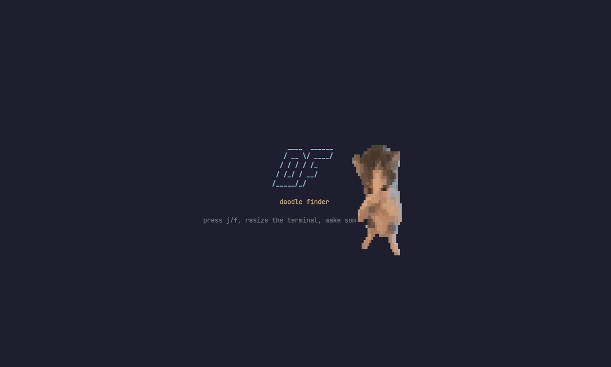
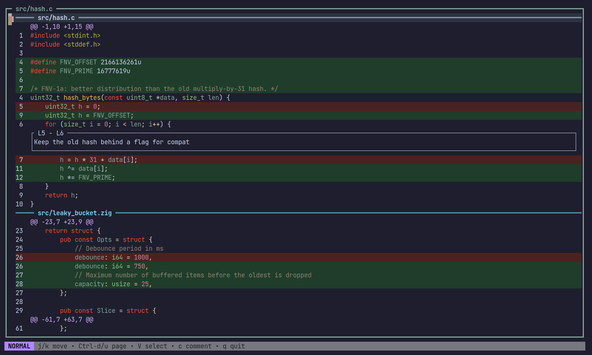
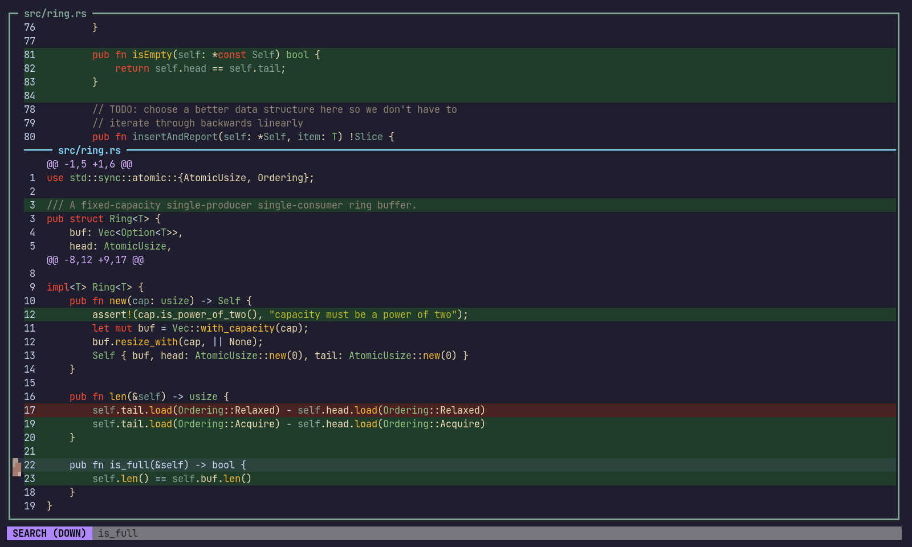

# ddf

A keyboard-driven terminal UI for reviewing your working-copy changes. ddf shows the current
[jj](https://github.com/jj-vcs/jj) diff with syntax highlighting. You can leave comments on lines or
ranges, then copy them all as one message for a reviewer or a coding agent.

Built with Zig, [notcurses](https://github.com/dankamongmen/notcurses) and
[tree-sitter](https://tree-sitter.github.io/).



## Features

- Unified diff view with old/new line numbers and file and hunk headers
- Tree-sitter syntax highlighting for Zig, C and Rust
- Vim-style navigation, visual line selection and search
- Inline comments on single lines or selected ranges
- `yy` copies all comments to the clipboard as formatted text (`wl-copy`, with an OSC 52 fallback)
- Animated splash screen (looks best in a terminal with pixel graphics, such as kitty, foot or WezTerm)

| Commenting on a change | Searching |
| --- | --- |
|  |  |

## Requirements

- Linux or macOS
- [`jj`](https://github.com/jj-vcs/jj) on your `PATH`. ddf runs `jj diff` in the current directory.
- Zig 0.16, notcurses and tree-sitter. The Nix flake provides all three.

## Building

With Nix (recommended):

```sh
nix build            # binary at ./result/bin/ddf
```

Or from the dev shell:

```sh
nix develop
zig-build            # binary at ./zig-out/bin/ddf
zig-build test       # run unit tests
```

Inside the dev shell, use `zig-build` rather than `zig build`. The wrapper sets the rpath and ELF
interpreter so the binary runs against Nix's libraries.

On macOS without Nix, `scripts/build-notcurses-macos.sh` builds notcurses with the tmux fix that the
flake applies.

## Usage

Run `ddf` from inside a jj repository, then press <kbd>Space</kbd> <kbd>d</kbd> <kbd>f</kbd> on the
splash screen to open the diff.

| Mode | Keys | Action |
| --- | --- | --- |
| Normal | `j` / `k`, `↓` / `↑` | Move down / up |
| | `Ctrl-d` / `Ctrl-u` | Page down / up |
| | `gg` / `G` | Jump to top / bottom |
| | `zz` | Center the focused line |
| | `V` | Start a visual line selection |
| | `c` | Comment on the focused line |
| | `/` / `?` | Search forward / backward |
| | `yy` | Copy all comments to the clipboard |
| | `q` / `Esc` | Close the diff (press `q` again on the splash screen to quit) |
| Select | `j` / `k`, `Ctrl-d` / `Ctrl-u` | Extend the selection |
| | `o` | Swap which end of the selection moves |
| | `c` | Comment on the selection |
| | `Esc` / `V` | Cancel the selection |
| Comment | `Enter` | Insert a newline |
| | `Esc` | Finish editing (empty comments are removed) |
| Search | `Enter` | Jump to the match |
| | `n` / `p` | Next / previous match |
| | `Esc` | Back to normal mode |

### Logging

Logs are written to `/tmp/ddf.log` and rotated automatically. Set the log level with
`DDF_LOG=debug|info|warn|err`.
